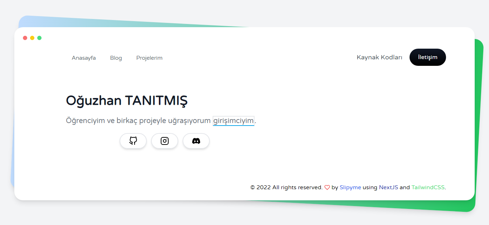

# Oğuzhan Tanıtmış Personal Page

[TypeScript](https://www.typescriptlang.org/), [NextJS](https://nextjs.org/) ve [TailwindCSS](https://tailwindcss.com/) ile kodlanmıştır.

# Çalıştırma & Kurulum

- `yarn` veya `npm i` ile modülleri indirin.
- `yarn build` veya `npm run build` ile build edin.
- `yarn start` veya `npm run start` ile projenizi başladın.
- `http://localhost:3000/` adresinde otomatik başlayacaktır.

- `yarn dev` veya `npm run dev` ile geliştirici sürümünde paylaşabilirsiniz.
- `http://localhost:8080` adresinde otomatik başlayacaktır.
